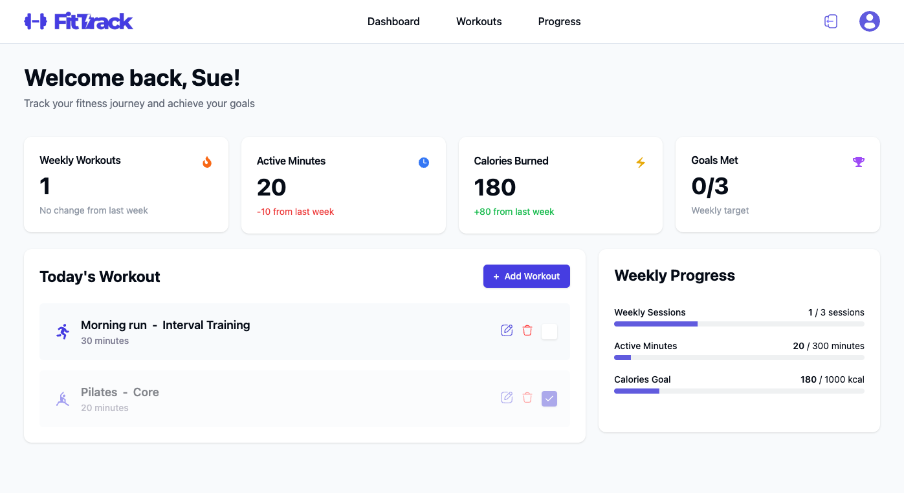
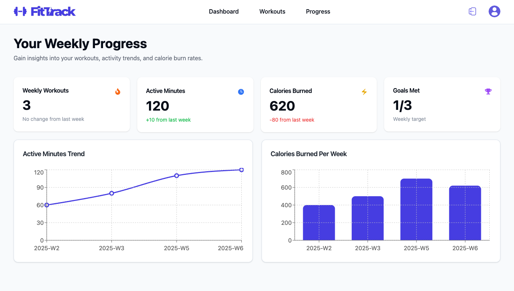

# 🏋️‍♂️ FitTrack - Personal Fitness Tracker

FitTrack is a web-based fitness tracking application that helps users **log workouts, track progress, and set goals**. Built with **React, TypeScript, Vite, Firebase, and TailwindCSS**, it provides an intuitive and interactive experience for users to monitor their fitness journey.

---
### 🔗 Live Demo
**[FitTrack - Live App](https://fittrack-hreca6l4k-suhyuns-projects-3e948b13.vercel.app/)**

## 🚀 Features

### ✅ **Workout Tracking**
- Log daily workouts with **duration, calories burned, and details**.
- Mark workouts as **completed** to track progress.
- Edit or delete logged workouts.

### 📊 **Progress Insights**
- View **weekly progress charts** for:
  - Active minutes
  - Calories burned
  - Total workouts completed
- Interactive **data visualization with Recharts**.

### 🎯 **Goal Management**
- Set **weekly fitness goals** (workouts per week, active minutes, calories).
- Track goal completion percentage.

### 🔒 **User Authentication**
- **Sign up & Log in** using Firebase Authentication.
- Secure authentication with email/password.
- Profile management with the ability to **edit profile details** and upload a profile picture.

### 🛠 **Built With**
- **React (TypeScript)**
- **Vite**
- **ShadCN UI (Radix UI)**
- **TailwindCSS**
- **Recharts (Data Visualization)**
- **Firebase (Auth, Firestore)**
- **React Query (Data Fetching & Caching)**
- **Jest & Cypress (Testing)**

## 🎨 UI Screenshots
| Dashboard | Progress Charts |
|-----------|-----------------|
|  |  |
